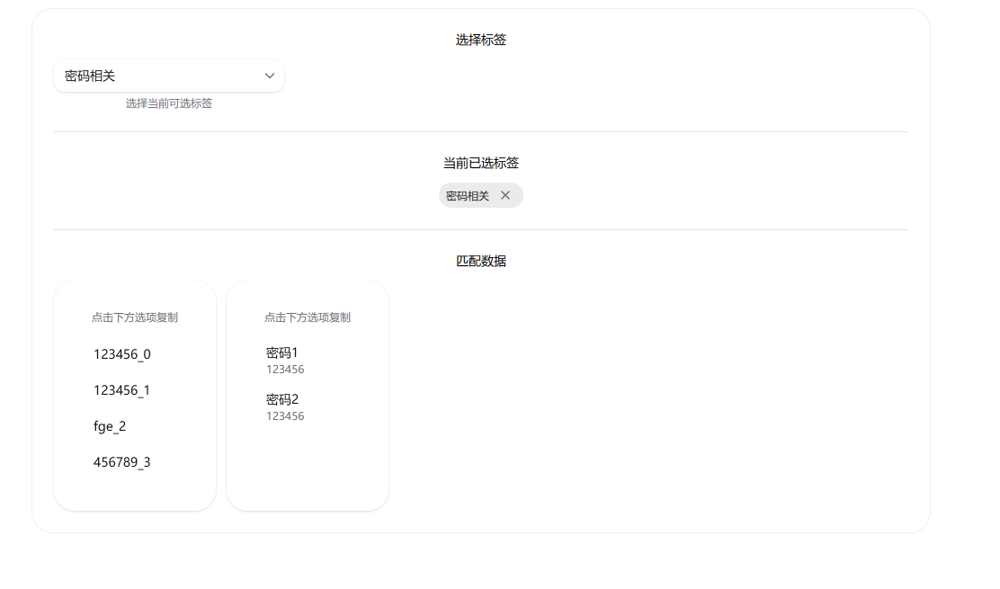

# Quicker Tree Select

基于标签的数据过滤和管理系统，支持多标签组合过滤、SQLite 持久化存储和在线数据编辑。



## ✨ 特性

- 🏷️ **多标签过滤** - 通过组合多个标签快速定位数据
- 💾 **SQLite 存储** - 可靠的本地数据持久化
- 🔄 **多种适配器** - 支持 JSON、CSV、SQLite 等多种数据源
- ✏️ **在线编辑** - 可视化的数据和标签管理界面
- 🎨 **现代 UI** - 基于 React 19 和 HeroUI 的响应式界面
- 📦 **Monorepo 架构** - 模块化设计，易于扩展

## 📦 包结构

```
packages/
├── quicker-tree-select-core/        # 核心过滤逻辑
├── quicker-tree-select-datasource/  # SQLite 数据管理
├── quicker-tree-select-adapter/     # 数据源适配器
└── quicker-tree-select-webui/       # Web 用户界面
```

## 🚀 快速开始

### 安装依赖

```bash
pnpm install
```

### 启动 Web UI

```bash
pnpm run dev:ui
```

### 构建项目

```bash
pnpm run build
```

## 📖 使用示例

### 1. 使用 SQLite 数据源

```typescript
import { DataSourceAPI } from 'quicker-tree-select-datasource'

const api = new DataSourceAPI('./data/my-data.db')

// 创建标签
const tag = await api.createTag({ name: '工作', color: '#FF0000' })

// 创建数据项
const item = await api.createDataItem({
  title: '项目文档',
  dataType: 'array',
  dataContent: ['文档1.pdf', '文档2.pdf'],
  tagIds: [tag.id],
})

// 查询数据
const items = await api.getDataItemsByTagIds([tag.id])
```

### 2. 数据格式转换

```typescript
import { JSONAdapter, SQLiteAdapter } from 'quicker-tree-select-adapter'

// JSON 转 SQLite
const jsonAdapter = new JSONAdapter()
const sqliteAdapter = new SQLiteAdapter()

const data = await jsonAdapter.importFromFile('./data.json')
await sqliteAdapter.exportToDatabase(api, data)
```

### 3. 核心过滤功能

```typescript
import { initDataWithState } from 'quicker-tree-select-core'

const { selectTag, stateData } = initDataWithState(dataSource)

selectTag('工作')
console.log('匹配的数据:', stateData.result.selectedTagsMatchedData)
```

## 📚 文档

- [架构设计](./ARCHITECTURE.md) - 系统架构和数据库设计
- [使用指南](./USAGE.md) - 详细的 API 文档和示例

## 🛠️ 技术栈

- **前端**: React 19, TypeScript, Vite, HeroUI, Tailwind CSS
- **数据库**: SQLite (better-sqlite3)
- **验证**: Zod
- **构建**: pnpm workspace, Rollup
- **测试**: Jest

## 📝 数据格式

```json
[
  {
    "tags": ["密码相关", "项目"],
    "data": ["password123", "admin456"]
  },
  {
    "tags": ["密码相关", "个人"],
    "data": {
      "邮箱密码": "email123",
      "银行密码": "bank456"
    }
  }
]
```

## 🤝 贡献

欢迎提交 Issue 和 Pull Request！

## 📄 许可证

MIT
